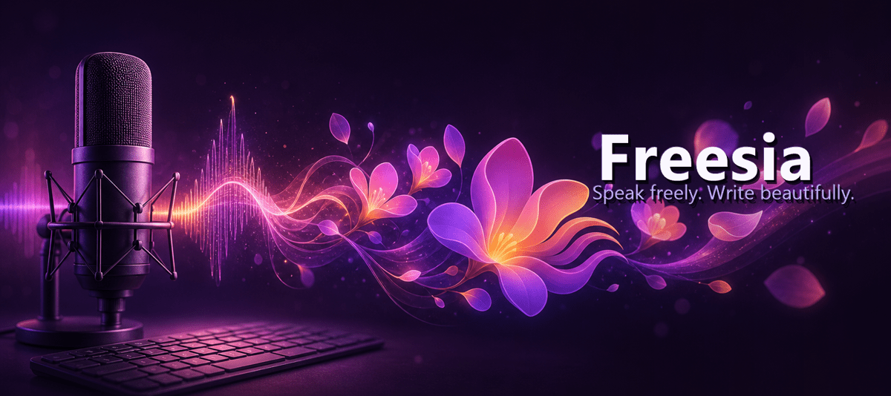

<p align="center">
  
</p>

# Freesia

Free, open-source AI voice dictation for Windows. Speak freely. Write beautifully.

<p>
  <a href="https://github.com/Arash-san/freesia/releases/latest">
    
  </a>
  <a href="https://github.com/Arash-san/freesia/releases">
    
  </a>
</p>

[](https://github.com/Arash-san/freesia/actions/workflows/release.yml)
[](LICENSE)

Freesia is a lightweight Electron app that uses your own Google Gemini API key for speech transcription and optional AI formatting. It stays out of the way in your tray, listens through global shortcuts, and types the final text into whichever app you are using.

## Download

Use the **Download for Windows** button above, or open the [latest release](https://github.com/Arash-san/freesia/releases/latest).

On the release page, download the file named `Freesia-Setup-...exe` from **Assets**. You do not need the source code zip unless you want to build the app yourself.

After installing, Freesia can check for updates from **Settings -> About -> Updates** and install new GitHub Releases when they are available.

Upgrading from Dictaloom? Freesia automatically migrates your API key, dictionary, snippets, history, and stats on first launch.

## Features

- System-wide dictation shortcut for typing into any Windows app
- Always-on-top floating overlay that follows your cursor's display
- Command mode for voice-driven edits to selected text
- Gemini 3.1 Flash-Lite by default, with filtered model selection for dictation-safe text output models
- Personal dictionary for names, technical terms, and custom vocabulary
- Context-aware voice snippets — triggers expand only when you clearly mean them, so a casual "thank you" never inserts your formal signature
- Rich stats: words, time saved, and sessions for today and all-time, plus day streaks and average words per session
- One-click copy buttons for saved history entries
- Beautiful light and dark themes that follow Windows by default
- Quick microphone test panel with a live waveform
- Local retry storage for recordings that fail to process
- In-app update checks backed by GitHub Releases

## Requirements

- Windows 10 or newer
- A Google Gemini API key from [Google AI Studio](https://aistudio.google.com/app/apikey)

Node.js 18+ is only needed for development.

## First Run

1. Install Freesia from the latest GitHub Release.
2. Launch the app and paste your Gemini API key.
3. Choose a Gemini model or keep the default.
4. Use `Ctrl+Shift+Space` to dictate into the active app.
5. Use `Ctrl+Shift+Alt+Space` for command mode when text is selected.

## Development

```bash
git clone https://github.com/arash-san/freesia.git
cd freesia
npm install
npm start
```

Useful scripts:

```bash
npm run dev       # Start Electron in development mode
npm run build     # Build the Windows installer locally
npm run package   # Build the Windows x64 package
npm run release   # Build and publish to GitHub Releases when GH_TOKEN is set
```

## CI/CD And Updates

The release pipeline lives in `.github/workflows/release.yml`.

1. Bump `package.json` with `npm version patch`, `npm version minor`, or `npm version major`.
2. Push the commit and tag:

   ```bash
   git push origin main --follow-tags
   ```

3. GitHub Actions builds the Windows installer with `electron-builder`.
4. The workflow publishes the installer, blockmap, and `latest.yml` to GitHub Releases.
5. Installed Freesia builds use `electron-updater` to check that release feed.

Manual release builds also work from GitHub Actions through **Run workflow**.

## Update Behavior

Freesia uses `electron-updater` with GitHub Releases. The release workflow uploads the Windows installer, blockmap, and `latest.yml`; installed builds use that metadata to find and download updates.

## Changelog

See [CHANGELOG.md](CHANGELOG.md) for release notes, including the rename from Dictaloom to Freesia.

## Project Layout

```text
assets/                 App icon, installer images, and README header
src/main/               Electron main process and updater integration
src/renderer/           App UI, styling, and renderer logic
.github/workflows/      Release automation
```

## Privacy

Freesia stores settings locally with `electron-store`. Your Gemini API key stays on your machine and is sent only to Google's Gemini API when you transcribe or format audio.

## License

MIT, see [LICENSE](LICENSE).
