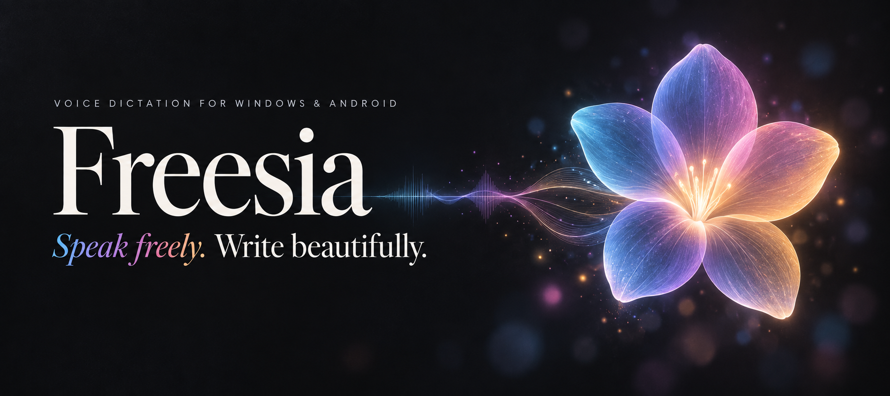

<p align="center">
  
</p>

# Freesia

Free, open source voice dictation for Windows. Speak freely. Write beautifully.

<p>
  <a href="https://github.com/Arash-san/freesia/releases/latest">
    
  </a>
  <a href="https://github.com/Arash-san/freesia/releases">
    
  </a>
</p>

[](https://github.com/Arash-san/freesia/actions/workflows/release.yml)
[](LICENSE)

Freesia lives in your tray. Press a shortcut in any app, talk, press it again, and your words are typed where your cursor is. A style decides how the text reads: faithful, casual, a formal email, bullet points, or anything you describe yourself.

Freesia 3 no longer needs a paid API. It can transcribe with a self hosted server, with a model that runs on your own PC, or with Google Gemini if you already have a key.

## Android

Freesia for Android dictates into any app through an accessibility service: focus a text field, tap the floating bloom, speak, and the text lands at your cursor. Choose Freesia Cloud or Gemini in Settings → Speech engine → Configure. Gemini uses your Google AI Studio API key for transcription and formatting. The app keeps every recording until its text is delivered so a failed take can be retried, and updates itself from GitHub. Download `Freesia-Android-<version>.apk` from the newest [android release](https://github.com/Arash-san/freesia/releases?q=android&expanded=true). Details are in [android/README.md](android/README.md).

## Speech engines

| Engine | Model | Where audio goes | Setup |
|---|---|---|---|
| Freesia Cloud | Qwen3-ASR 1.7B on vLLM | A Freesia Voice server you trust | Server address, username and password |
| On this PC | Qwen3-ASR 1.7B or 0.6B (GGUF) through llama.cpp | Never leaves your computer | One download of 1 to 2.5 GB |
| Google Gemini | Gemini Flash models | Google | Your own API key |

Qwen3-ASR 1.7B was the most accurate open speech model on the Hugging Face Open ASR Leaderboard when Freesia 3 shipped (4.3% average English WER), and it also understands Persian, Arabic, Chinese and about thirty other languages. On our tests with LibriSpeech audio it transcribed a 130 second recording in about one second on an RTX 5090 server, and in under four seconds on the same card through the bundled runtime.

If the chosen engine fails, Freesia tries the other engines you have set up. If all of them fail, the recording is saved and you can retry it from History. Nothing you say is lost.

### On this PC

The on device engine downloads a 32 MB llama.cpp Vulkan build and the Qwen3-ASR weights into `%APPDATA%\freesia\engines`, checks every file against a pinned SHA-256, and starts a private server on `127.0.0.1` protected by a random key. It picks your strongest graphics card automatically and falls back to the CPU. The 1.7B model needs about 3.6 GB of GPU memory, so an RTX 4060 laptop runs it comfortably. The 0.6B model suits older laptops and CPU only machines.

### Smart formatting

Styles, snippets, spelling cleanup, spoken emoji and polish are applied by a language model after transcription. Freesia uses the Freesia Cloud formatter when you are signed in, then Gemini if you added a key. You can also turn formatting off and get the raw transcript.

## Features

Dictation works in every Windows app, including remote desktop sessions, because Freesia pastes with hardware scan codes. Command mode edits the text you selected: select a paragraph, press `Ctrl+Shift+Alt+Space` and say "make this friendlier". A floating pill shows your live voice level, and Escape cancels. You can change both shortcuts in Settings.

Your personal dictionary is sent to the speech model as vocabulary hints, so names and jargon are spelled right. Snippets expand only when you clearly mean them. Styles can switch automatically by app, and you can write your own or let an AI agent write them (see [AGENTS.md](AGENTS.md)). History is searchable and stays on your PC, and the home screen shows words, time saved, streaks and the last thirty days of activity.

## Privacy

Settings stay on your PC. The Gemini key and the Freesia Cloud token are encrypted with your Windows account through Electron `safeStorage` and never reach the interface process. The Freesia Voice server stores no audio and no transcripts.

Optional error reports contain the app version, the operating system, the engine name and the error text, plus an anonymous install ID. They never contain audio, transcripts, keys or tokens. New installs enable them by default with a visible switch on the first setup screen.

## Requirements

Windows 10 or newer. For the on device engine, any GPU with Vulkan support and 4 GB of memory is ideal, and a CPU works too. Node.js 22 is only needed for development.

## First run

1. Install Freesia from the latest release.
2. Choose an engine. Sign in to Freesia Cloud with your server address, username and password, download the on device model, or paste a Gemini key.
3. Pick your microphone and watch the level meter move.
4. Press `Ctrl+Shift+Space` in any app, speak, and press it again.

Upgrading from 2.x keeps your Gemini key, dictionary, snippets, styles and history.

## Freesia Cloud

Freesia Cloud connects to a Freesia Voice server: a small authenticated service that runs Qwen3-ASR on a GPU and speaks the OpenAI transcription API. Enter the server address, username and password you were given on the Engines page. The server itself is not part of this repository.

## Development

```bash
git clone https://github.com/arash-san/freesia.git
cd freesia
npm install
npm start
```

| Script | Purpose |
|---|---|
| `npm test` | Unit tests for the renderer, engines, WAV splitting and updates |
| `npm run test:native` | Electron smoke test with a fake microphone |
| `npm run shots` | Screenshots of every view in dark and light themes into `.tmp/shots` |
| `node test/run-e2e.cjs` | End to end run on real speech (needs local test assets) |
| `npm run package` | Build the Windows installer |

## Project layout

```text
src/main/            Electron main process, engines, app scanner, key helper, updater
src/renderer/        Interface: index.html, app.js, js/ (orb, ui, audio, vocab), styles/, fonts/
scripts/             Icon and installer art generators
android/             Freesia for Android
test/                Unit, native, screenshot and end to end tests
```

## Releases and updates

Bump the version with `npm version`, then push the commit and tag with `git push origin main --follow-tags`. GitHub Actions builds the installer and publishes it with `latest.yml`, and installed copies of Freesia find it through `electron-updater`. Freesia checks at startup, every five minutes, after sleep and when you reopen it, and it only installs after you confirm.

## License

MIT, see [LICENSE](LICENSE). Bundled fonts (Geist, Geist Mono, Instrument Serif, Vazirmatn) are under the SIL Open Font License; their licenses are in `src/renderer/fonts`.
